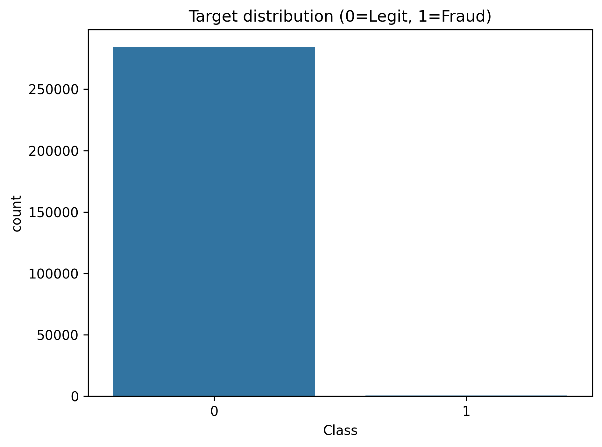
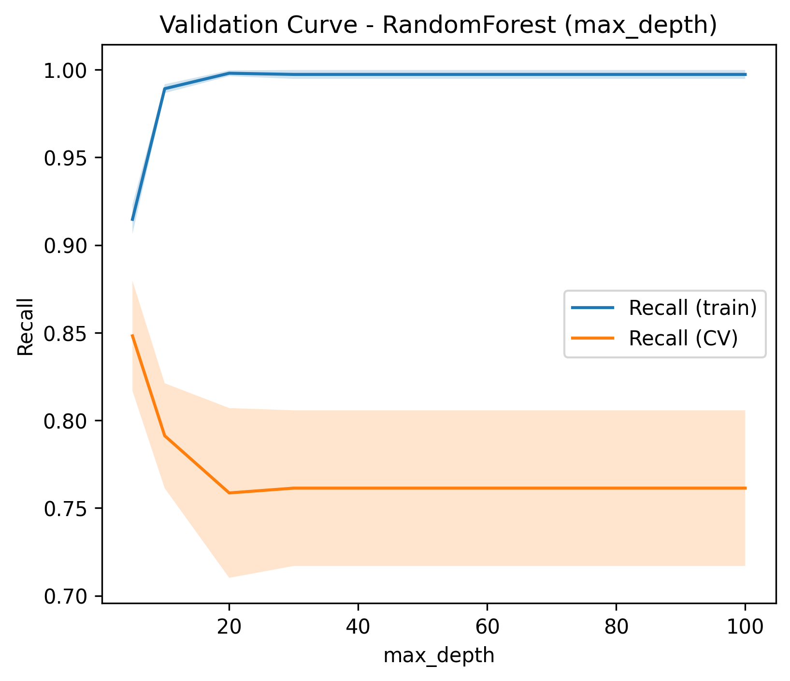
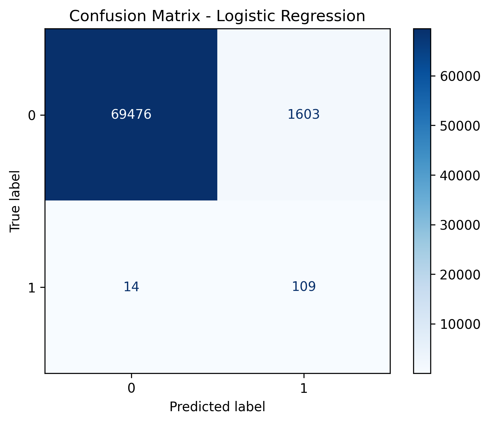
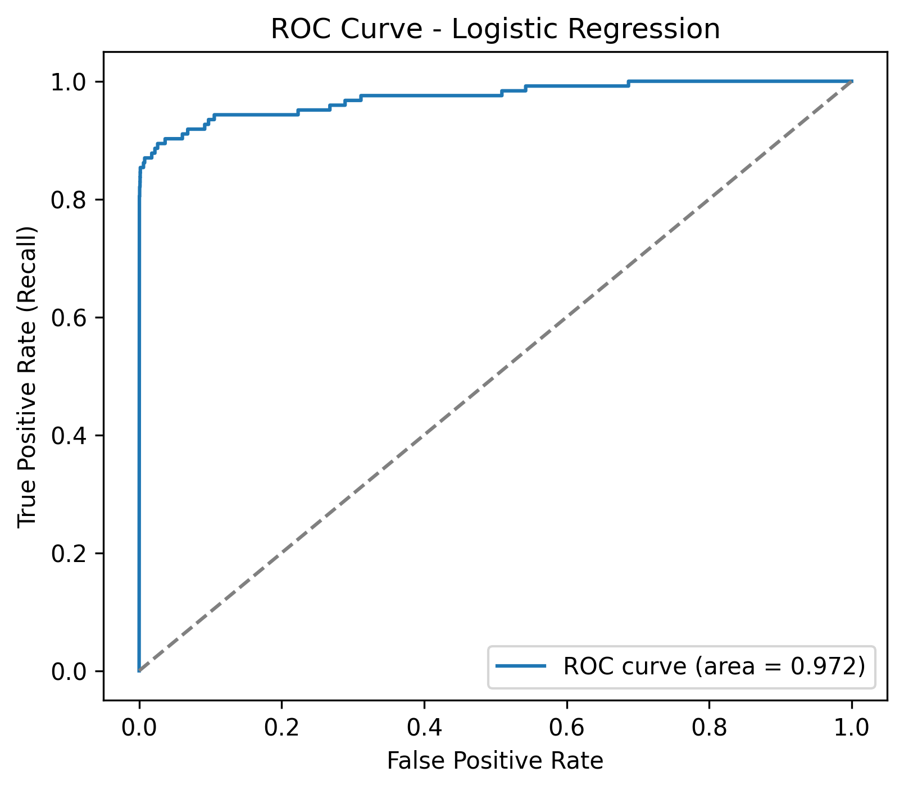
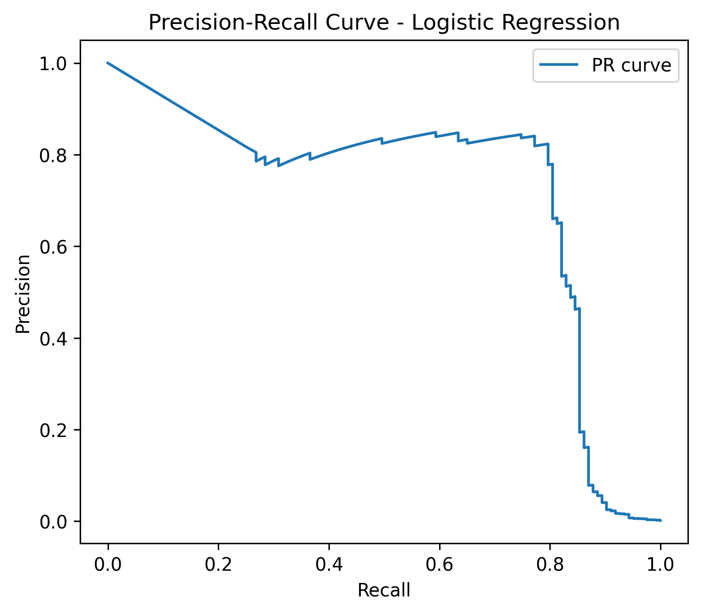

# Credit Card Fraud Detection

Fraud detection is a real-world and highly challenging problem due to the massive class imbalance.  
This project was an opportunity for me to apply machine learning to a practical case,  
from exploratory data analysis all the way to deploying a final model ready for inference.

---

## Dataset

The dataset used is the well-known **Kaggle Credit Card Fraud Detection dataset** (`creditcard.csv`).  
It contains anonymized transaction features (PCA-transformed) plus the original `Amount` and `Time` variables.

- **Size**: 284,807 transactions × 31 features  
- **Target**: `Class` (0 = legitimate, 1 = fraud)  
- **Imbalance**: only **492 frauds (0.173%)** vs **284,315 legitimate (99.827%)**

---

## 📊 Step 1 - Exploratory Data Analysis (EDA)

I first explored the dataset to understand its structure:

- No missing values  
- The **`Amount`** feature is highly skewed (skewness ≈ **16.98**)  
- The target distribution is extremely imbalanced  

**Target distribution**



---

## ⚙️ Step 2 - Preprocessing

The preprocessing was kept minimal:

- Dropped **`Time`** (useless for fraud detection)  
- Separated the target **`Class`**  
- Standardization applied only on **`Amount`** (using `StandardScaler`)  
- The PCA components `V1…V28` are already scaled  
- Data split with `train_test_split(..., stratify=y)` to preserve the fraud ratio  
- Pipelines (`ColumnTransformer` + estimator) used to ensure reproducibility

---

## 🤖 Step 3 - Models and Training

I compared several models:

- **Logistic Regression** with class balancing and hyperparameter tuning  
- **Random Forest** with `RandomizedSearchCV` and further tuning (tested depth, number of trees, sampling)  
- **XGBoost** with both random and grid search, optimizing directly for **PR-AUC** (better suited for imbalanced data).  
  Final training included **early stopping** on a validation set using PR-AUC.

**Validation curve (Random Forest - max_depth vs Recall)**



---

## ✅ Step 4 - Evaluation and Results

I evaluated all models on the test set.  
Here are the main metrics (ROC-AUC, PR-AUC, Recall, Precision, F1):

| Model | ROC-AUC | PR-AUC | Recall | Precision | F1 |
|---|---:|---:|---:|---:|---:|
| Logistic Regression | 0.9724 | 0.6929 | 0.8862 | 0.0637 | 0.1188 |
| Random Forest (tuned) | 0.9738 | 0.8321 | 0.7724 | 0.9048 | 0.8333 |
| XGBoost (baseline) | 0.9831 | 0.8608 | 0.8374 | 0.8306 | 0.8340 |

The results show that while Logistic Regression struggles due to imbalance, Random Forest improves recall, and XGBoost achieves the best overall trade-off.

For illustration, here are the diagnostic plots of Logistic Regression:

- Confusion matrix  



- ROC curve  



- Precision–Recall curve  



---

## 🏆 Step 5 - Final Model: XGBoost

The final model chosen is **XGBoost**, trained with early stopping:

- **Best iteration**: 954  
- **Best validation PR-AUC**: 0.8397  

At the **default threshold (0.5)**, the model achieves:  
- Precision = 0.933  
- Recall = 0.797  
- F1 = 0.860  

At the **optimized threshold (0.855)**, tuned for the best F1-score, the model achieves:  
- Precision = 0.967  
- Recall = 0.797  
- F1 = 0.874  

This shows that by adjusting the threshold, XGBoost provides a strong balance between catching frauds (recall) and avoiding false alarms (precision).

---

## 💻 Step 6 - Using the Model

The final pipeline was exported with `joblib`:

`models/xgb_final_model.pkl`

Example of loading and using the model:

```python
import joblib
import pandas as pd

# Load the trained pipeline
model = joblib.load("models/xgb_final_model.pkl")

# Example new transactions
X_new = pd.DataFrame([...])  # must have the same columns as training

# Get predicted probabilities
probas = model.predict_proba(X_new)[:, 1]

# Apply the decision threshold
threshold = 0.855
preds = (probas >= threshold).astype(int)
```

## 📝Conclusion

This project highlighted the challenge of detecting fraud in a highly imbalanced dataset.  
After testing multiple models, **XGBoost** proved to be the best compromise.  
At the optimized threshold, it reaches **96.7% precision** and **79.7% recall**, making it both robust and practical for real-world fraud detection.
This balance allows the model to catch most fraudulent transactions while minimizing false alarms, which is crucial in real banking systems.
